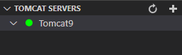

# 简介

这是一个 Java Web 基础项目，用于演示 Azure DevOps 的基本功能。

# 功能介绍 

这个演示主要涉及到 Azure DevOps 的功能包括：

1.  源码保存在 Azure Repos 中
2.	源码 commit 时关联 Azure Pipelines 的 CI 流水线自动构建
3.	自动构建结果保存到 Azure Artifacts
4.	Azure Pipelines 中使用 Release 发布到虚机上安装的 Tomcat Server

# 使用 VS Code 做 Java Web 开发的主要配置 

VS Code 搭配 Java, mvn 和 Tomcat 插件，可以方便地进行 Java Web 项目的开发，还可以实现热部署。VS Code 比传统的 Eclipse 和 IDEA 都要轻便，配合相应插件，功能强大，使用方便，是 Java Web 开发的好工具。只不过这些插件还需要再配置一下才能组合成顺手的 Java 开发环境。

## Java 运行环境
需要安装以下程序，具体安装说明不复杂，记得添加环境变量。

* JDK
* Apache Maven
* Tomcat Server

注意本地 Tomcat Server 安装完成，测试成功后要把它停止服务，还要配置成不随操作系统启动，因为后面我们用 VS Code 中的TOMCAT 插件来管理 TOMCAT 服务器，本地默认安装和启动的服务会有冲突。

Maven 解压后，在 path_to_maven/conf/settings.xml 中加上国内镜像

```
    <mirror>
    <id>alimaven</id>
    <name>aliyun maven</name>
    <url>http://maven.aliyun.com/nexus/content/groups/public/</url>
    <mirrorOf>central</mirrorOf>
    </mirror>
```  
这样可以启用国内镜像下载更快。

## VS Code 需要安装的插件

* Java Extension Pack
* Java Test Runner
* Language Support for Java by Red Hat
* Maven for Java
* Project Manager for Java
* Tomcat for Java

VS Code 安装好上述插件后需要配置些 Java 相关的配置，比如 Maven for Java 的 配置文件路径。

### 创建 Java Web 项目
上述插件都装好后，IDE 左下角会出现  MAVEN 面板，在 MAVEN 面板右上角点 Create Maven Project 了。在弹出的 maven archetype 对话框中，可以搜索选择 maven-archetype-webapp，就可以创建一个 Java Web App 项目了。

在 TOMCAT SERVER 控制面板右上角，点 + 符号，添加已经安装的 Tomcat 服务器程序即可。在这个 Tomcat9 服务器上右键菜单点 Start，就可以启动了。注意，这不是之前咱们自己安装的 Tomcat 服务器，它是 VS Code 的 TOMCAT 插件复制出来的一套Tomcat 服务器环境。打开浏览器，访问 [http://localhost:8080/](http://localhost:8080/) 应该能看到一个默认页了，没有任何部署的包。

创建一个 JSP 文件，再创建一个  Java Servelet 文件测试一下。然后在 VS Code 的 TERMINAL 执行 mvn clean package 就可以构建打包成 war 了，打包好的 war 包会生成在 Java web 项目的 /target 目录下。我按照 TOMCAT SERVER 插件的文档，在 war 包上右键菜单，最后一条 Run on Tomcat Server，并没有部署到这个Tomcat 服务器上，什么反应也没有。



没关系，后面会配置这个 Tomcat 服务器，使其可以自动加载 war 包。

### 部署 Tomcat 服务器自动部署

在 TOMCAT SERVER 面板中已经添加的 Tomcat9 服务器上右键菜单，选 Open Server Configuration。在打开的 server.xml 中下面这一段做如下设置
```
<Host name="localhost" appBase="webapps" unpackWARs="true" autoDeploy="true">
        <Context docBase="path_to_java_web_project/target/hello" path="/hello" reloadable="true"/>
        <Valve className="org.apache.catalina.valves.AccessLogValve" directory="logs" prefix="localhost_access_log" suffix=".txt" pattern="%h %l %u %t &quot;%r&quot; %s %b"/>
</Host>
```

注意这里的 docBase 取什 "path_to_java_web_project/target/hello" 就是前面 mvn 打包生成的 war 包的路径，不带 .war 后缀。

实际上，我并不需要每个文件保存时都自动部署，我更喜欢改几个文件改好后，再手工执行一下构建和部署。所以我只做到 mvn clean package 一键构建，之后 Tomcat Server 可以自动加载新 war 包，而 Tomcat 9 已经不需要重启，可以热部署，这样对我来说就够了。

### 可能出现的问题和解决办法

* 创建一个 Java Servelet 文件，需要 javax.servlet.* 时，报错找不到这些库。

在 pom.xml 加个依赖库即可。
```
<dependency>
  <groupId>javax.servlet</groupId>
  <artifactId>servlet-api</artifactId>
  <version>2.5</version>
</dependency>
```

* TOMCAT SERVER 插件管理的 Tomcat 服务器不能停止。

在 TOMCAT SERVER 面板中已经添加的 Tomcat9 服务器上右键菜单，选  Stop，服务器不能停止，OUTPUT 面板报错：

SEVERE: No shutdown port configured. Shut down server through OS signal. Server not shut down.

在 TOMCAT SERVER 面板中已经添加的 Tomcat9 服务器上右键菜单，选 Open Server Configuration。在打开的 server.xml 中
把
```
<Server port="-1" shutdown="SHUTDOWN">
```
改成
```
<Server port="8005" shutdown="SHUTDOWN">
```
就好了。


# Azure DevOps 配置

## Repos 配置

在 Azure Repos 中创建一个源码库，然后使用任何自己熟悉的 git 客户端都可以，也可使用 VS Code 中的 Git 插件来管理。

## pom.xml

要使用 Azure Pipelines 进行构建，需要指定 Maven 编译的版本，我测试时只能使用 1.7。在 pom.xml 文件中设置。

```
  <properties>
    <project.build.sourceEncoding>UTF-8</project.build.sourceEncoding>
    <maven.compiler.source>1.7</maven.compiler.source>
    <maven.compiler.target>1.7</maven.compiler.target>
  </properties>
```

## Artifacts 配置
新建 Artifacts 的 Feed 时，建议选中 Include packages from common public sources，这样可以包含上源公共源的库。

要使用 Maven 连接 Azure Artifacts 的 Feed ，按照控制台上使用 Maven 连接的向导配置即可。在 pom.xml 文件里的 `<repositories>` 和 `<distributionManagement>` 加上当前 Feed 的地址，Maven 安装目录下的 settings.xml 配置文件  path_to_maven/conf/settings.xml 中加上 `<servers>` 段加上 Personal Access Token 用于验证。

这样的配置方式，可以把连接信息放在 pom.xml 文件中使用源码管理，而验证信息在源码库以外，正好不会暴露在源码库中。

## Pipelines

把源码 commit 到 Azure Repos。

创建一个 Pipeline 用于 CI ，这个 Pipeline 任务就会根据 pom.xml 的配置把源码构建到 Artifacts 的 Feed 中。

## 使用 Release 流水线把 Artifact 发布到 Tomcat Server

Release > Agent job 中的 Agent Specification 选择 ubuntu-20.04。
